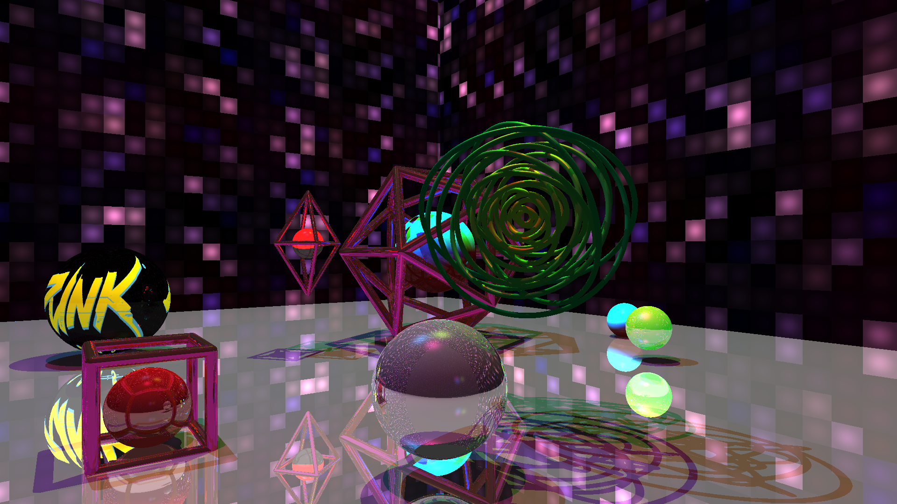

# NUS-SoC-Summer-Workshop-Final-Showcase
Third-prized Cyberpunk-styled Shader Implementation, run on shadertoy website (WebGL). Completed in collaboration with Sun Hao from Sichuan University and Li Zenan from HUST. To run the shader properly, you should operate as following instruction:

1. Create BufferA and put the final_showcase.frag to BufferA.

2. Put final_showcase_filter.frag to Image.

3. Open the Browser's console (F12 in Chrome) and input the following codes to it:

```C
for (let i = 0; i < 4; ++i)
{
    d = document.createElement('div');
    d.className = "upload";
    d.innerHTML = '<button onclick="document.querySelector(\'#texture' + i + '>div.upload>div>input\').click()" style="width:100%;">Upload</button>' +
    '<div style="display:none;"><input type="file" accept="image/*"/>' +
    '<p>#</p></div>';
    document.querySelector('#texture' + i).append(d);
    document.querySelector('#texture' + i + '>div.upload>div>input').addEventListener('change', function ()
    {
        if (this.files && this.files[0])
        {
            let p = document.querySelector('#texture' + i + '>div.upload>div>p');
            URL.revokeObjectURL(p.innerText);
            p.innerText = URL.createObjectURL(this.files[0]);
            gShaderToy.SetTexture(i, { mSrc: p.innerText, mType: 'texture', mID: 1, mSampler: { filter: 'mipmap', wrap: 'repeat', vflip: 'true', srgb: 'false', internal: 'byte' } });
        }
    });
}

```

Reference from https://www.shadertoy.com/view/lsGGDd . This codes is aiming at adding custom texture to shadertoy.

4. Click BufferA, then Click iChannel1. Upload the cyberpunk.png in this folder. Then, you can see the right side ball have it's color.


